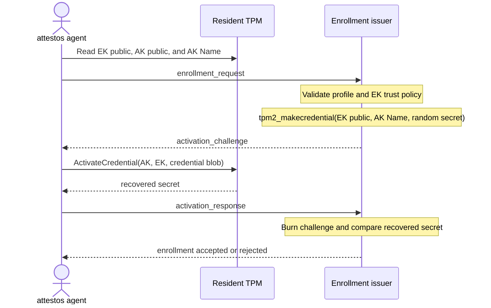
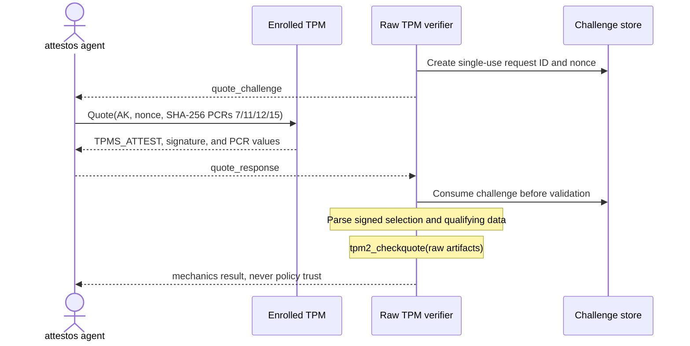

# attestos TPM Protocol v1

Status: frozen mechanics contract. No production trust authority.

The canonical machine-readable contract is `attestation.schema.json`. Its six
message kinds are:

1. `identity_challenge`
2. `enrollment_request`
3. `activation_challenge`
4. `activation_response`
5. `quote_challenge`
6. `quote_response`

## Trust stages

Implementations must report these stages independently:

- `quote_valid`: `tpm2_checkquote` verified the raw TPM message, signature,
  qualifying data, and ordered PCR digest values.
- `same_tpm_ak`: credential activation proved that the named AK is available
  under the EK used by the enrollment challenge.
- `manufacturer_trusted`: the EK certificate and public key were validated
  against an explicitly pinned manufacturer trust store.
- `policy_trusted`: the signed PCR selection, PCR values, event logs, boot
  policy, security version, and revocation state all passed.

Only the conjunction of all four may become a production trust decision.
QEMU/swtpm can establish the first two mechanics stages only.

## Algorithms and bounds

Version 1 supports one profile deliberately:

- RSA 2048 EK
- RSA 2048 AK
- RSASSA with SHA-256
- SHA-256 PCR bank
- PCR selection 7, 11, 12, and 15
- 32-byte verifier-generated qualifying data

All binary values use strict RFC 4648 base64. Unknown fields and unsupported
algorithms fail closed. The raw `TPMS_ATTEST` and TPM signature are preserved.
`pcrs_b64` is exactly 128 bytes: four ordered SHA-256 digest values captured
by the same `tpm2_quote` command. It carries no client-controlled selection
header. The verifier reads the selection from signed TPMS_ATTEST and supplies
the fixed `sha256:7,11,12,15` interpretation to its checker.

## Enrollment

The client sends the EK public key, optional EK certificate, AK public key,
and AK Name. The registrar validates the EK trust chain before production use,
then runs `MakeCredential` for a random 32-byte secret and the supplied AK
Name. The client runs `ActivateCredential` with its resident AK and EK and
returns the recovered secret. Equality proves same-TPM AK mechanics; it does
not by itself prove that the TPM is genuine.

`device_class=emulator` is admissible only to a verifier explicitly configured
for a mechanics canary. Such an enrollment always has
`manufacturer_trusted=false`.

`MakeCredential` uses the EK public area and AK Name at the registrar. It does
not contact the client's TPM. `ActivateCredential` is the operation that must
run against the resident TPM and proves that the enrolled AK and EK are
available together there.

## Quote

The verifier issues random qualifying data and burns it on the first response,
successful or not. The client passes the raw bytes to `tpm2_quote -q` and uses
the same command's `-o` PCR output, avoiding a later `tpm2_pcrread` race.

Version 1 uses `binding_mode=nonce_only`. This provides freshness and replay
resistance, but not second-machine relay resistance. A caller-provided channel
identifier is intentionally absent because hashing an untrusted value does not
bind the quote to a transport. Production transport binding requires a later
version in which the attesting endpoint derives a non-exportable binding from
the authenticated server channel.

The diagrams are explanatory views of the schema and implementation. The JSON
Schema remains the wire authority, and the verifier code and tests remain the
behavioral authority.

## Deployment identity and event logs

`deployment_claim` is explicitly a claim. It is not trusted merely because the
client reports `bootc status`. It gains authority only through verified event
logs, PCR policy, and signed image metadata.

The firmware and systemd event logs are separate artifacts. A mechanics canary
may omit them, but then `policy_trusted` must remain false.
